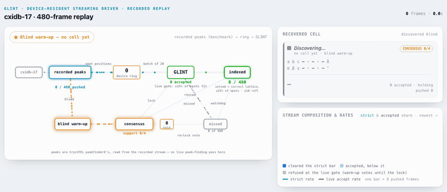

# GLINT — a fast GPU-native blind crystallography indexer

GLINT indexes sparse single-shot serial-crystallography (SFX) diffraction **blind** (no unit
cell supplied) on the GPU. It proposes candidate real-space axes from a gridless objective,
anneals cells, keeps the *N*-best hypotheses per frame, derives the unit cell across frames by
**consensus**, and rescues the remaining frames with a cell-general GPU known-cell indexer. It
ingests exactly what a CrystFEL / LUTE peak search emits and writes a CrystFEL `.stream`, so it
drops into the existing CrystFEL-based merging flow (`partialator`).

On one NVIDIA A100, over 480 sparse cxidb-17 lysozyme frames, GLINT **matches** the strongest blind
indexer we tested — 361 of 480 frames against xgandalf's 350 at the same gate, a difference that is
not significant (McNemar *p* = 0.18) — at **~450×** the throughput. Deriving the cell by consensus
rather than being handed it costs nothing at that gate (361 against 357 with the cell supplied) and
about ten frames at the looser ≥10-reflection bar (458 against 468 of 480).

**New here?** [`docs/onboarding.md`](docs/onboarding.md) has a short primer on *what crystallographic
indexing is and what GLINT does*, plus how to set up, run, and contribute.

**Checking the paper?** [`REPRODUCING.md`](REPRODUCING.md) maps every table and figure to the
script, data and command that regenerates it — including what reproduces on a laptop from data
committed here, and what does not reproduce from this checkout at all.

## The streaming driver, replayed

<picture>
  <source media="(prefers-color-scheme: dark)" srcset="docs/media/streaming_cxidb17_480_dark.gif">
  
</picture>

A recorded replay of the shipped `glint.stream_driver.StreamDriver`, cold-started with no cell —
not a live beamline and not a simulation. The input is the 480-frame extension of the cxidb-17
lysozyme run (CXIDB entry 17, Boutet *et al.* 2012, CC0): CrystFEL peakfinder8 peaks converted to
q-vectors at one fixed wavelength, the paper's primary streaming set and *not* the published
120-frame subset. The arm is the paper's: the constructor defaults (apart from a batch of 20 and
the live gate's `min_inliers=10`) plus the two published opt-ins `warmup_rescue` and
`adaptive_relock`, recorded on one NVIDIA A100 — other boxes differ by a frame. Consensus locks
the cell at frame 5 and the five frames spent on discovery are re-indexed against it; the
watchdog then rescues six frames the batch pass had missed; near event 364 the adaptive re-lock
*adds* a second cell to the active set — a spurious one, not lysozyme, voted by frames the locked
cell does not explain — and it adds nothing to the count, which is scored against the first
locked cell only. The run ends at **331/480 frames indexed at the strict correct-lattice bar
(≥25% of spots and ≥10 reflections), 69.0%**, the top of the paper's 67–69% band on this set
(the 67% is the same driver at its shipped defaults; the two opt-ins buy the last two points). The frame rate is a display choice; every counter, the lock frame, the rescues and the
re-lock are read out of that one recorded run. Provenance, per-frame semantics, stills and the
regeneration recipe are in [`docs/streaming_replay.md`](docs/streaming_replay.md).

## Install

```bash
pip install -e .        # from a checkout; CPU works, CUDA is used automatically if available
```

Requires Python ≥ 3.9 and `numpy`, `scipy`, `torch`, `h5py` (installed automatically).

## Command-line

```bash
# what a CrystFEL / peakfinder8 run emits: a peak-search stream + a .geom
glint --peaks peaks.stream --geom detector.geom -o indexed.stream

# or pre-bridged reciprocal q-vectors (FRAME blocks, 3 cols, 1/Angstrom)
glint --qframes frames.txt -o indexed.stream
```

Options: `--cell "a b c al be ga"` (known cell, skip consensus) · `--nbest N` (multi-hypothesis
consensus, default 3) · `--mode auto|sparse|dense` · `--integrate` (real I/σ) · `--tofile` (hand
orientations to CrystFEL for the refined merge) · `--device cpu|auto` · `-N` (limit frames).

## LUTE pipeline

GLINT ships LUTE Task and DAG definitions in [`lute/`](lute/), so it runs as a drop-in replacement
for `CrystFELIndexer` in the LCLS SFX workflow:

    PeakFinderSFX -> [GLINTIndexer] -> StreamFileConcatenator -> PartialatorMerger -> HKLManipulator

The reason it exists: none of LUTE's bundled CrystFEL builds are compiled with FFBIDX support, so
`indexamajig --indexing=ffbidx` fails and GPU fast-feedback-style indexing is unavailable in LUTE
today. GLINT fills that gap, emitting a CrystFEL `.stream` the downstream stages already understand.

**Pick a merge route.** GLINT's default stream carries the cell and the per-frame orientation, with
placeholder `I=0.00` intensities — everything a *refiner* needs and nothing a *merger* does. One of
the two settings below turns it into a mergeable dataset; which one you want depends on whether you
want CrystFEL in the pipeline:

* **`integrate: true`** — no CrystFEL step. GLINT predicts and box-integrates its own reflections
  and writes real I/σ, so the stream flows straight through the concatenator to
  `PartialatorMerger`. Prediction runs on the GPU; the box gather itself is host numpy on this
  route. This is the configuration of the validated end-to-end run.
* **`tofile:`** — hand the orientations to `indexamajig --indexing=file`, added as a task between
  `GLINTIndexer` and `StreamFileConcatenator`, so CrystFEL's prediction refinement imposes the
  lattice symmetry. Note that `tofile:` alone is not enough: without the added task the DAG
  concatenates the placeholder stream.

Which merges *better* is not settled — see
[glint#129](https://github.com/slac-lcls/glint/issues/129), where the only head-to-head ran the two
routes at unmatched integration settings. Matching them closed the CC\* gap, and the R_split
difference that remains is explained by multiplicity and a selection cut rather than by intensity
quality. Choose on dependencies, not on an expected quality ranking.

Configuration for both, including the traps worth knowing on the `tofile:` route, is in
[`lute/README.md`](lute/README.md). Install the Task into a LUTE tree with
[`lute/install_into_lute.sh`](lute/install_into_lute.sh).
[`lute/STATUS.md`](lute/STATUS.md) is the evidence behind this integration: every measurement with
its run, the negative results, and the assumptions that have never been tested.

## Library

```python
from glint.geom import parse_geom, read_crystfel_peaks, peaks_to_q   # CrystFEL .geom + peaks -> q
from glint.hybrid_stream import hybrid_index                         # blind -> consensus -> rescue
from glint.stream import write_stream                                # results -> CrystFEL .stream
```

The blind front-end (`glint.glint_fast.index_blind_nbest`), the consensus
(`glint.multishot.consensus_cell`), and the GPU known-cell rescue
(`glint.replica_gpu.index_known_gpu_cell`) are all individually importable. The `experiments/`
directory holds the research scripts and diagnostic harness (not shipped in the wheel).

## Roadmap & contributing

Open directions live in [`ROADMAP.md`](ROADMAP.md): real-data validation and LCLS productization,
faster M1–M6, breaking the **blind convergent-beam (CBXD)** wall, and exploratory extensions to
**powder** (metric-tensor auto-indexing → Rietveld) and **Laue / pink-beam** (the fat Ewald sphere) —
all resting on the same gridless objective + GPU consensus. Settled questions and negative results are
in [`docs/results.md`](docs/results.md). How to work in the repo (branches/PRs, envs, validation gates)
is in [`CONTRIBUTING.md`](CONTRIBUTING.md) and [`docs/onboarding.md`](docs/onboarding.md).

## Origins

GLINT's blind sparse indexer is a gridless **multi-start optimizer + cross-frame selector** (not an
FFT). The **3-D-FFT** method it grew out of (the *fftindex* prototype — a learned peakfinder + multi-shot
consensus on the transform volume) is now the **dense-data** (rotation / many-peak) front end. That
research write-up is preserved in [`docs/lineage.md`](docs/lineage.md).

## Copyright

Copyright (c) 2026, The Board of Trustees of the Leland Stanford Junior University, through SLAC National Accelerator Laboratory (subject to receipt of any required approvals from the U.S. Dept. of Energy). All rights reserved.
GLINT was developed at SLAC with support from DOE's Basic Energy Sciences and Advanced
Scientific Computing Research programs, including the ILLUMINE project. Work at SLAC National
Accelerator Laboratory is supported by the U.S. Department of Energy under contract
DE-AC02-76SF00515.

**Usage restrictions.** Neither the name of the Leland Stanford Junior University, SLAC National
Accelerator Laboratory, U.S. Department of Energy nor the names of its contributors may be used to
endorse or promote products derived from this software without specific prior written permission.

**Licence.** GLINT is released under the terms in [`LICENSE.md`](LICENSE.md) (BSD 3-Clause with a
SLAC Enhancements grant-back). Third-party material carrying its own terms is recorded in
[`THIRD_PARTY_NOTICES.md`](THIRD_PARTY_NOTICES.md). The notice above is also in
[`COPYRIGHT`](COPYRIGHT) as a standalone file, which is where the DOE contract number lives.
