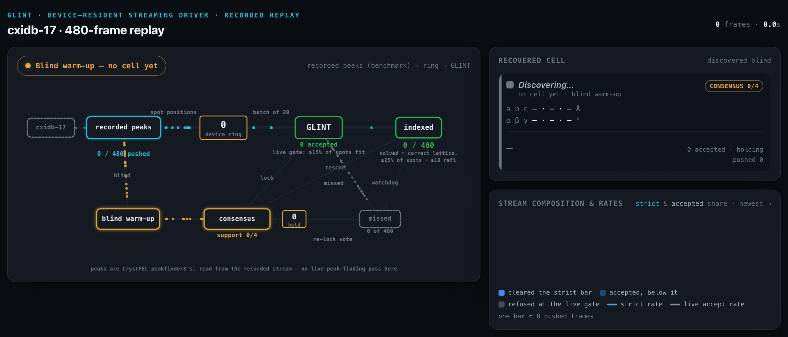
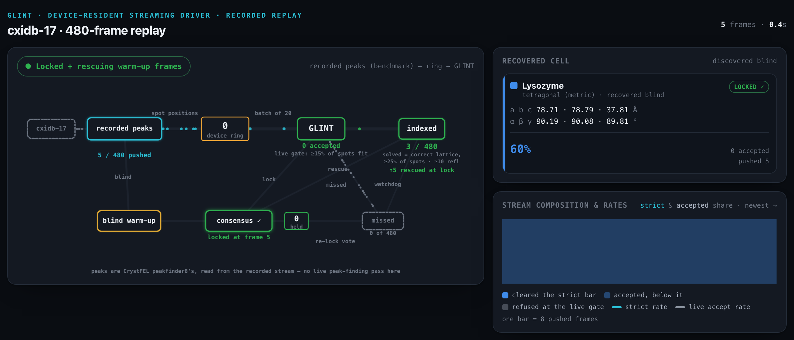
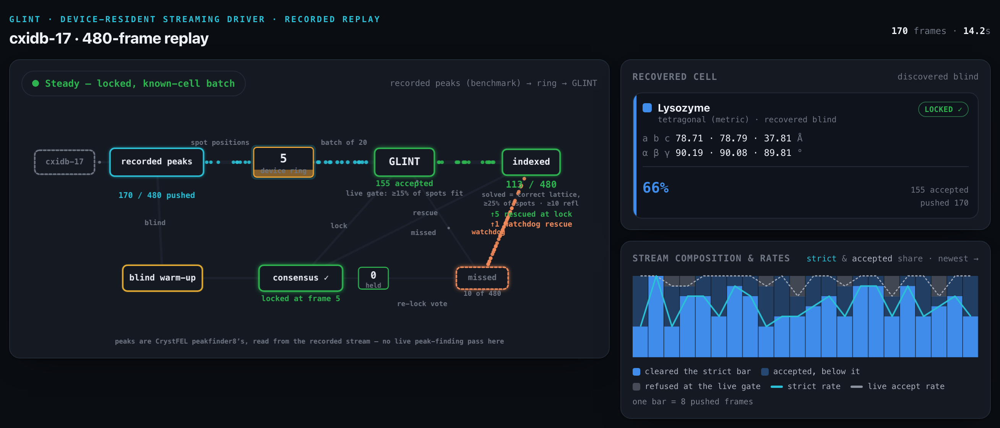
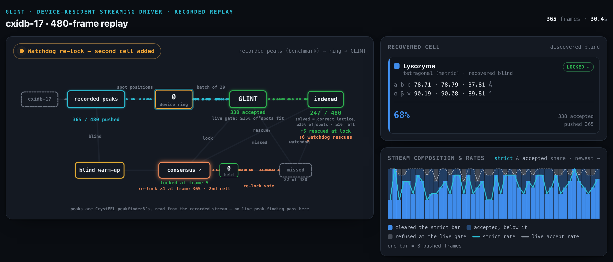
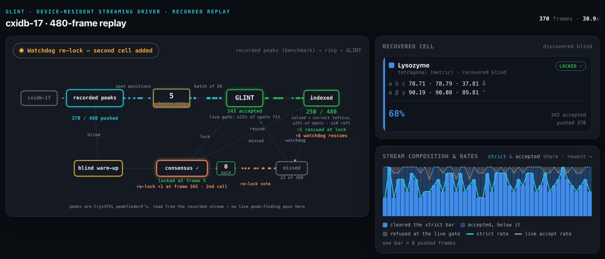
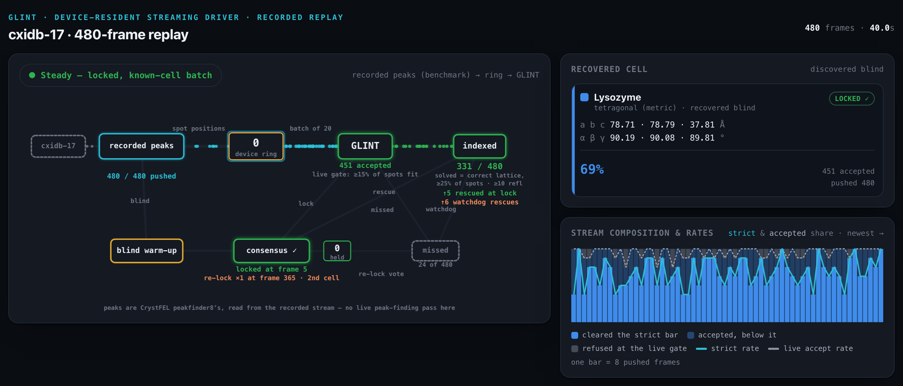

# The streaming driver, replayed — provenance of the README animation

The animation at the top of [`README.md`](../README.md) (`docs/media/streaming_cxidb17_480_dark.gif`
and `_light.gif`, one per colour scheme) is a **screen recording of a replay page** that plays back
**one recorded run** of the shipped `glint.stream_driver.StreamDriver`. It is not a live beamline, not a
simulation, and nothing on it is drawn from a model: every counter, the recovered cell, the lock
frame, the ring occupancy, the rescues and the re-lock are read out of a trace the driver wrote while
it ran. This page says exactly what that run was, how each animation frame maps onto it, what the
crop removed from the replay page, and how to regenerate the whole thing.

## What was run

| | |
|---|---|
| Input | The **480-frame extension** of the cxidb-17 sparse lysozyme run (CXIDB entry 17, Boutet *et al.* 2012, CC0) — the paper's primary streaming set. One protein, one run, the same crystals as the published 120-frame subset; 480 buys statistical power, not generality. Nothing injected, nothing planted, no second species, no drift. |
| Peaks | CrystFEL 0.12.0 `peakfinder8` peaks read out of the blind `indexamajig` stream for these 480 images and converted to reciprocal-space q-vectors through the package's own bridge, `glint.geom.read_crystfel_peaks` + `peaks_to_q`. No pixels are replayed and no peak finder runs in the replay: the driver is fed q-vectors. |
| Wavelength | **One fixed wavelength for every frame** (1.322216 Å = 9377.00 eV, frame 0's photon energy) rather than the per-shot SASE energy. That is the convention the published 120-frame q lists were built under; it is worth a few frames per arm, so it is stated rather than assumed. |
| Indexer | `glint.stream_driver.StreamDriver` at commit `2d6eacb53a33`, cold-started with no cell (`Mc=None`). |
| Arm | `B=20, dmin=2.0, tol=0.002, warmup_nbest=3, warmup_rescue=True, adaptive_relock=True, min_inliers=10`; live accept gate `min_inlier_frac=0.15`, `min_inliers=10`, `min_peaks=6`. That is the constructor's defaults apart from the batch size (20, not the default 64) and the live-gate minimum (10, not 0), plus the two opt-ins the paper publishes as arms. It is the `+relock` arm of `experiments/gap_on_real.py` (same keywords; that script derives `dmin` from the data rather than fixing 2.0). |
| Off | retry cascade, live geometry refinement, second-lattice (double-hit) detection, alias gate, lock probe, miss-buffer rescue, warm-up batch fan-out, stream output. |
| Box | NVIDIA A100-SXM4-40GB (host `sdfampere042`), Python 3.9.18, numpy 1.26.3, cupy 12.3.0, torch 2.1.0.post302; 10.5 s of wall time for the whole run. Other GPU architectures can move the count by a frame (the 120-frame arms are one frame lower on an H200), which is why the box is named. |
| Scoring | The paper's strict research bar: correct lattice (`same_lattice` against the driver's own first locked cell) **and** ≥25% of the frame's spots matched **and** ≥10 reflections. The driver's own live gate is looser (count-only); both are on screen. |

Result: consensus locked after **5 frames** on 4 votes (support 4); the 5 frames
spent on discovery were re-indexed against the locked cell and **3** of them cleared the strict bar.
The driver accepted **451 of 480** at its live gate and refused 24. At the strict bar the run indexes
**331 / 480 = 69.0%** — 328 post-lock plus the 3 rescued warm-up frames. That is the high end of the
band the paper prints for the streaming driver on this set, **67–69% (323–331 of 480)**: the low end
is the same driver with `warmup_rescue` and `adaptive_relock` both off, so the two options enabled
here are published arms, not tuned ones. The offline known-cell reference on the same frames at the
same gate is 357/480 (74.4%). The 331 is also the value `experiments/check_numbers.py` carries as
`stream_rate_rescue_of480`, and `README.md` is one of the files that guard checks.

Recovered cell, printed as measured and not re-jittered for display:
a = 78.706, b = 78.792, c = 37.813 Å, α = 90.189°, β = 90.083°, γ = 89.811° — the same lattice as the
lysozyme reference (`same_lattice_vs_reference: true`).

## Per-frame semantics

The replay page keeps a clock, "*N* frames · *T* s". Animation frame *i* (1-based, the number the
clock shows) is the state **after trace record *i* − 1 (0-based) has been pushed**; frame 0 is the
page before anything is pushed (empty chart, "Discovering…"). The display rate is 12 frames per
second of playback, so the clock reads *i*/12 s; it is a display choice and has nothing to do with the
driver's speed.

The trace has 480 records with these fields per pushed frame: `npk` (peaks), `o` (outcome: 1 =
accepted at the live gate, 2 = warm-up, else refused), `buf` (device-ring occupancy after the push),
`wu` (warm-up frame), `lock` (lock fired here), `resc`/`resc_ok` (warm-up frames rescued / clearing
the strict bar at the lock), `sup` and `lead` (consensus support and lead), `m`/`frac` (matched
reflections and matched fraction), `ok` (cleared the strict bar), `flush` (batch of this size
indexed), `wresc` (watchdog rescue), `relock` (adaptive re-lock fired here).

Events, verified against the trace (`python3 -c "import json; tr=json.load(open('docs/streaming_replay/cxidb480_strace_a100.json'))['trace']; ..."`):

| On-screen frame | Trace record (0-based) | What happens |
|---|---|---|
| 5 | 4 | `lock=0`, `sup=4`, `resc=5`, `resc_ok=3`: consensus locks; the 5 warm-up frames are re-indexed, 3 clear the strict bar. Strict count 3 / 480. |
| 170, 174, 183, 222, 236, 325 | 169, 173, 182, 221, 235, 324 | `wresc=1`: the six watchdog rescues — frames the batch pass missed, blind-solved one at a time and accepted after all. |
| 365 | 364 | `relock=1` on a 20-frame flush: the adaptive re-lock **adds** a second cell to the active set. The trace header records this as `relock_frame: 364` — the 0-based record — so "near event 364" is the safe phrasing; the on-screen badge says "re-lock ×1 at frame 365" because the clock is 1-based. The badge holds amber for 2 s of playback (through frame 389). |
| 480 | 479 | Last flush (15 frames). Strict count **331 / 480**, accepted 451, refused 24, ring 0. |

Cumulative strict counts read off the trace at the filmstrip frames: 3 (frame 5), 113 (170), 247
(365), 250 (370), 331 (480); every one matches the on-screen counter in the corresponding still
below. Command: `sum(r['ok'] for r in tr[:N])` for N in (5, 170, 365, 370, 480) → 3, 113, 247, 250, 331.

## What the crop removed — the honesty text

The GIF is the top 560 px of the replay page: the schematic, the cell card and the stream chart. Below
the crop the page carries prose that qualifies every number on it. It is reproduced here because the
GIF cannot carry it.

* **The first 120 of this list are not the published 120-frame subset.** Sliced to its first 120
  frames this input gives 79 at the strict bar with both opt-ins (`sum(ok)` over records 0–119 = 79;
  the replay page states 76 / 79 for the two arms) where the published subset gives 73 / 78: the
  rebuilt q lists keep peaks in the last fractional pixel of each panel that the pre-fix geometry code
  dropped. Different peak lists, expected, not a discrepancy — but it is why the number in the README
  is quoted with its input named, and why no 120-frame band number appears beside it.
* **Fixed wavelength.** See the table above. The published q lists were built under one fixed
  wavelength; this run follows them so the arms are comparable, at a cost of a few frames per arm.
* **Panels were stripped, not faked.** The replay page descends from a richer streaming-monitor
  template. Every panel that the shipped driver at this configuration does not fill was removed
  rather than left idle or filled from a model: no detector-geometry box (`geom_refine=False`), no
  operational-QA or spurious-meter row (no injections in a benchmark replay; `lock_probe=False`), no
  sample-mixture panel (one protein), no blind-fleet multiplier (the warm-up blind indexer is serial),
  no second-lattice KPI (`double_hit=False`), no blank/veto lane (the benchmark peak lists are already
  hit-selected). What is left is what the driver does: fill a device ring of B frames, batch-index them
  against the locked cell, accept or refuse each at the live gate, and — before any of that — discover
  the cell blind from the first frames by consensus, then rescue the frames discovery spent. The
  live-monitoring direction itself belongs with the LCLStreamer project, not with this replay.
* **No space-group symbol — metrics only.** The cell card prints the six lattice parameters as
  measured and the lattice system they imply ("tetragonal"); the label "Lysozyme" is the reference
  lattice the locked cell was checked against. Nothing on the page asserts a space group, and the
  strict bar is a lattice test, not a symmetry assignment.
* **The re-lock is spurious and adds nothing to the count.** Near event 364 the adaptive re-lock
  fires. It does not replace the locked cell; it *adds* a second cell to the active set, and that cell
  (87.464, 87.556, 109.462 Å; 69.336°, 72.747°, 100.715°) is **not** the lysozyme lattice
  (`same_lattice_vs_locked: false`, `same_lattice_vs_reference: false`). It is a cell voted by frames
  the active set could not explain — the paper's SI describes it the same way: not a second crystal
  form but the response to an accumulation of unexplained frames. Every number on the page is scored
  against the *first* locked cell only, so the re-lock changes nothing in the 331; it is on screen
  because it is what the mechanism did. The paper's "cell composition" diagnostic is the readout for
  this case — a second cell that accumulates frames mid-run indicates a sample change, one that
  accumulates almost none is an alias that survived the gate — but the trace scores against the first
  cell only and does not record the second cell's share, so that reading is left to the driver's own
  report, not asserted here.

## Regeneration

The recorded trace, the builder that turns it into the replay page, and the built replay page are
committed as read-only copies under [`docs/streaming_replay/`](streaming_replay/) (a separate commit,
so it can be dropped without touching the README or the media):

* `cxidb480_strace_a100.json` — the driver trace: a header (dataset, peaks, wavelength convention,
  `driver_kw`, gate definitions, the recovered cell, counts, the published band, host provenance) and
  480 records. Its top-level key is `trace`.
* `build_cxidb480_monitor.py` — builds the replay page from the trace. It starts from a streaming
  monitor template that is **not** in this repository, so it documents the build rather than
  reproducing it from a bare checkout; it fails fast if any anchor it edits is missing, and asserts
  `EXPECT_TOTAL, EXPECT_FRAMES = 331, 480`.
* `glint_streaming_cxidb480_real.html` — the built replay page, self-contained (the trace is inlined
  as `TRACE`). Open it in a browser to see the same replay with its prose; `?theme=dark|light`,
  `?print=1` (hide the controls, freeze the state) and `?warm=W` (pre-advance the clock by *W* seconds
  of playback) are the switches the capture used.

Capture recipe (macOS, Google Chrome 152 headless, Pillow 10.4; no ffmpeg):

1. For each animation frame *i* = 0 … 480, compute the `?warm=` value that yields exactly *i* frames on
   the clock by replaying the page's own advance loop (`for (acc=0; acc<W; acc+=0.033) advance(0.033)`,
   frames shown = Σ floor(12·0.033 + carry)) in IEEE doubles; frame 0 is the page with no `?warm`.
   Never capture past 480: `?warm ≥ 40.083` wraps to frame 1.
2. Launch one headless Chrome per frame with a fresh `--user-data-dir`, `--force-device-scale-factor=1
   --window-size=1320,896 --virtual-time-budget=1500 --screenshot=f_%04d.png` on
   `glint_streaming_cxidb480_real.html?theme=<dark|light>&print=1&warm=<W>`; poll for a size-stable PNG
   (Chrome never exits on its own because of the rAF loop), then kill it. Four in parallel, ~3.5 s per
   frame per process, ~7 min per theme for 481 frames. A blank-frame guard (grey-level std over the
   chart interior and the schematic) recaptures a frame whose canvases had not drawn; 0 of 962 needed it.
3. Crop to the footer-free top of the page: `(6, 0, 1314, 560)` in the dark theme, `(6, 0, 1314, 563)`
   in the light theme (the light stream card casts a drop shadow that reaches 3 px lower). Resize to
   900 px wide (Lanczos) and write one GIF with a **single global 256-colour median-cut palette**
   built from a mosaic of 9 frames sampled evenly across the run, no dither, `optimize=True`,
   `disposal=1`, 83 ms per frame requested → 80 ms stored (GIF delays are centiseconds), `loop=0`.
   481 frames play in 38.5 s. Sizes: dark 2.54 MB (900×385), light 2.32 MB (900×387).
4. The stills below are the same page at `--force-device-scale-factor=2` (2640×1792 raw, same crop
   box doubled → 2616×1120 / 2616×1126), one Chrome launch each.

## Filmstrip (dark theme; light-theme twins are `light_f*.png` alongside)

| Still | Frame | What it shows |
|---|---|---|
|  | 0 | Nothing pushed yet: "0 frames · 0.0 s", badge amber "Blind warm-up — no cell yet", cell card "Discovering…", consensus support 0/4, 0 / 480 pushed, indexed 0 / 480. |
|  | 5 | The lock: "5 frames · 0.4 s", badge green "Locked + rescuing warm-up frames", "locked at frame 5", "↑5 rescued at lock", 0 accepted yet at the live gate, cell card LOCKED with the measured lysozyme cell; indexed 3 / 480 (the 3 rescued warm-up frames that clear the strict bar). |
|  | 170 | Steady state with the first watchdog rescue: "170 frames · 14.2 s", badge green "Steady — locked, known-cell batch", ring 5, 155 accepted, "↑1 watchdog rescue" flashing on the missed → indexed edge, 10 of 480 missed; indexed 113 / 480 (66%). |
|  | 365 | The re-lock, near event 364: "365 frames · 30.4 s", badge amber "Watchdog re-lock — second cell added", "re-lock ×1 at frame 365 · 2nd cell", consensus node highlighted with re-lock vote dots, 338 accepted, 22 of 480 missed; indexed 247 / 480 (68%). The re-lock itself adds nothing to the count. |
|  | 370 | Five frames later the amber hold persists (it lasts through frame 389): "370 frames · 30.9 s", ring 5, 343 accepted, "↑6 watchdog rescues" now all in; indexed 250 / 480 (68%). |
|  | 480 | The end: "480 frames · 40.0 s", badge green "Steady — locked, known-cell batch", 480 / 480 pushed, 451 accepted, 24 of 480 missed, "↑5 rescued at lock", "↑6 watchdog rescues", "re-lock ×1 at frame 365 · 2nd cell", cell 78.71 · 78.79 · 37.81 Å / 90.19 · 90.08 · 89.81°; **indexed 331 / 480 (69%)**. |

The on-screen percentages are rounded to whole numbers by the page (69% at the end); the README quotes
331/480 = 69.0% to one decimal because the band it sits in is printed to the percent.
