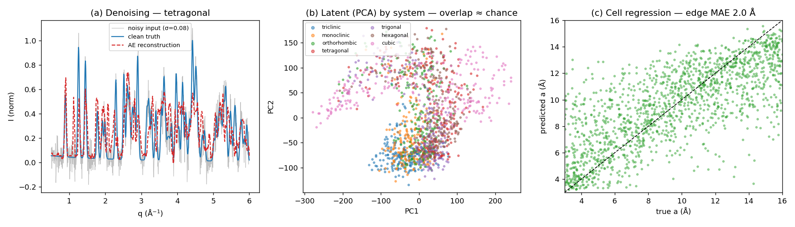

# powder_ml — powder autoencoder + cell-regression head

> Relocated here from the public `slac-lcls/drp-benchmarks` repo to keep it private. `powder_index.py`
> is bundled (a copy of the drp-benchmarks powder autoindexer) so this directory is self-contained.

A **learned** counterpart to the classical `radial_integration/powder_index.py` autoindexer: a 1-D
convolutional **autoencoder** on `I(q)` powder profiles (denoising + compact latent) with a supervised
**head** predicting the crystal system + unit cell straight from the profile — no explicit peak extraction.

```
python train.py 12000 60     # ~25 s on an A100
python eval.py               # denoising / latent / accuracy / head-to-head vs index_powder
```

- `sim_dataset.py` — random cells across all 7 systems → distinct d-spacings (reuses `powder_index`'s
  `cell_to_metric`/`_centering_ok`) → fixed-length `I(q)` (1024 bins, pseudo-Voigt peaks + background),
  labelled with (cell, system, centering).
- `model.py` — 1-D conv encoder → latent (32) → conv-transpose decoder; MLP head → cell (6) + system (7).
- `train.py` — denoising AE (noisy in → clean target) + supervised head; loss = MSE(recon) + 5·MSE(cell) + 0.5·CE(system).
- `eval.py` — the four evals below.

## Results (measured, A100; synthetic held-out)


*Left→right: denoising (noisy input → AE reconstruction vs clean truth); latent PCA coloured by crystal system (overlap ≈ chance, silhouette ~0); cell-regression scatter (predicted vs true a, edge MAE ~2 Å).*

| eval | result |
|---|---|
| **Denoising** | recon RMS ~0.133 **flat** across input noise 0→0.10 (noise doesn't propagate) |
| **Latent clustering by system** | silhouette ≈ **−0.02** (≈ chance) — systems overlap in latent space |
| **Head accuracy** | system **70 %** (chance 14 %), edge MAE ~2 Å; per-system cubic 94 % → ortho 50 % |
| **Head-to-head vs `index_powder`** (system from the same profile) | AE **85–88 %** @ **~2 ms** vs classical **33–53 %** @ **~2000 ms** |

## Honest reading
- **The learned head beats the classical pipeline for *system-from-a-messy-profile*, ~1000× faster and
  noise-robust** — because `peaks_from_profile → index_powder` is bottlenecked by **peak extraction** from
  dense/overlapping/noisy profiles, while the AE reads the whole profile. The win is regime-specific: on
  **sparse, clean, well-separated** patterns the classical ab-initio solver would fare much better (and it
  does the *harder* task — the exact cell, not a 7-way label).
- **The AE is a fast triage / phase-ID + coarse-cell estimator, not a precise indexer** (2 Å edge MAE). Its
  natural role: **fast shot triage** (which system? is this the expected phase?) and **seeding** the classical
  `index_powder` (a rough cell narrows its search) — complementary, not a replacement.
- **Latent does not self-cluster by system** (silhouette ~0): the profile is governed by cell *dimensions*
  more than system, so unsupervised phase-separation needs a better prior (contrastive / cell-normalised
  latent) — a documented next step.

## Follow-ups tested (measured — two clean negatives)
Two of the "where it could go" ideas below were actually run; both came back negative, which sharpens the
verdict (the AE is a triage tool, not a drop-in for the exact solver):

- **AE-seed → `index_powder` (`hybrid_eval.py`).** Use the AE's system + coarse cell as a PRIOR to constrain
  the exact solver (`systems=` + `amin/amax`). Head-to-head on 40 high-sym held-out patterns (EDGE_TOL 0.5 Å):

  | variant | exact-cell recovery | ms/pattern | vs cold |
  |---|---|---|---|
  | cold (4 systems, amin2–amax20) | 42 % | 1678 | — |
  | AE **system+edge** window | 22 % | 730 | 2.3×, **−20 pts** |
  | AE **edge-only** (keep all systems) | 42 % | 1502 | 1.1×, **±0 pts** |

  → The AE prior does **not** improve exact indexing. The **system** guess is too weak on the 4 confusable
  high-sym systems (~35 % here) so hard-restricting `systems=(AE)` throws away the right cell when it's wrong;
  the **edge** window is reliable (MAE ~2 Å) but too coarse to prune the seed-and-verify combinatorics
  (only 1.1×). AE-seeding stays where the head-to-head above puts the AE: fast triage, not a seeder.

- **Contrastive latent (`train.py` `LAM_CON`, supervised SupCon on the normalised latent).** Targets the
  silhouette≈0 negative. Result: silhouette **−0.029 → +0.015** (still ≈ chance, no real clustering) at a
  small head-accuracy cost. The systems genuinely overlap in `I(q)` space (profile ∝ cell **size**, not
  system) — a light contrastive term doesn't separate them; a stronger prior would be needed (cell-normalised
  input, a projection head + larger weight, or much more capacity). Opt-in (`LAM_CON=0` reproduces the AE).

## Where it could go (still open)
Bigger model + more data (system acc likely > 70 %); **cell-normalised** profiles so the latent can cluster by
system rather than size; train/eval on **real** LCLS radial averages (this uses simulated profiles). Torch-
gated research code — **not** part of the dependency-free `radial_integration` primitives; it reuses their simulator.
